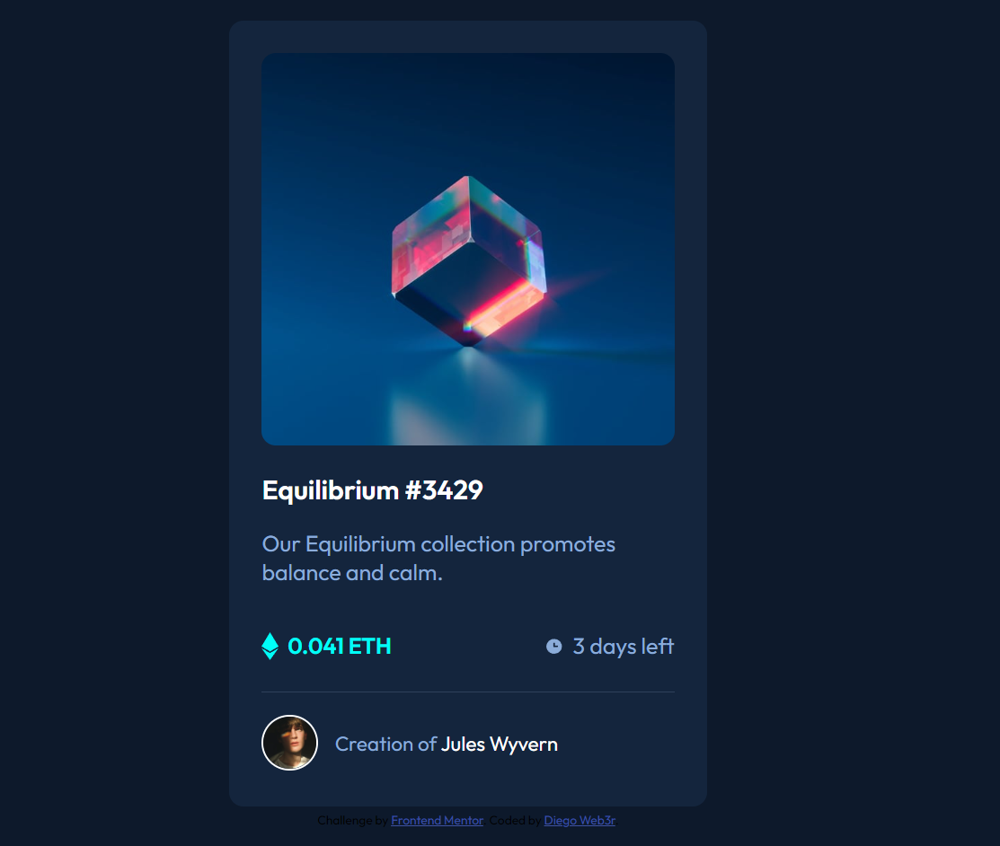

<h1 align="center"> NFT Preview Card</h1>

Projeto frontend realizado através dos desafios do site <a href="https://www.frontendmentor.io/challenges/nft-preview-card-component-SbdUL_w0U">Frontend Mentor  

  <a href="#-tecnologias">Tecnologias</a>&nbsp;&nbsp;&nbsp;|&nbsp;&nbsp;&nbsp;
  <a href="#-projeto">Projeto</a>&nbsp;&nbsp;&nbsp;|&nbsp;&nbsp;&nbsp;
  <a href="#-layout">Comentários</a>&nbsp;&nbsp;&nbsp;&nbsp;&nbsp;&nbsp;

 
<h2 align="center">Proposto:</h2>

  

<h2 align="center">Realizado:</h2>

  

## 🚀 Tecnologias

Esse projeto foi desenvolvido com as seguintes tecnologias:

- HTML e CSS
- Git e Github

## 💻 Projeto

Card simples para pré-visualização de um produto NFT.

- [Visite o projeto online](https://diegoweb3r.github.io/Frontend-Mentor-NFT-preview-card-component/)

## :book: Comentários
Mais um desafio relativamente tranquilo. A dificuldade maior foi trabalhar com a imagem. A decisão pode nao ter sido a melhor, apesar de ter funcionado

Feito por Diego Web3r

